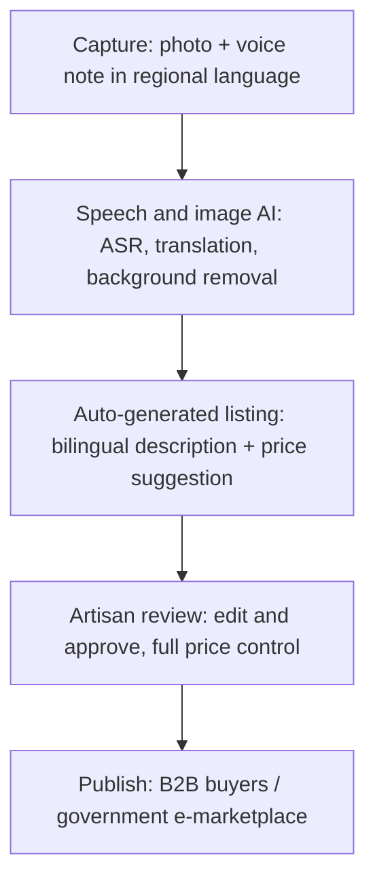
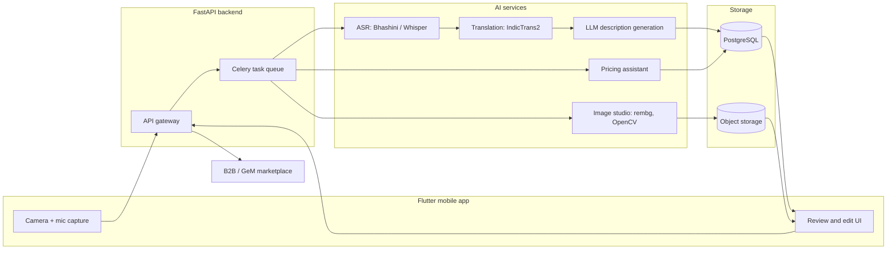

# AI-Driven Market Linkage and Smart Cataloging Mobile Application for Marginalized Artisans

| Field | Value |
|---|---|
| Problem Statement ID | 26090 |
| Organization | Ministry of Social Justice and Empowerment (MoSJE) |
| Department | Department of Social Justice and Empowerment |
| Category | Software |
| Theme | Heritage & Culture |
| Reference / competing builds | craftiq-ai.ai.studio, KalaSetu |

---

## 1. Problem Statement

### Background
The government supports marginalized micro-entrepreneurs, artisans, and weavers through financial assistance for small-scale manufacturing and handicraft units. Market exposure today is largely limited to periodic physical exhibitions and trade fairs (Shilp Samagam, Surajkund Mela, Dilli Haat). This gives a temporary sales boost but no continuous, year-round digital sales channel. Transitioning to digital commerce is blocked by low digital literacy, language barriers, and a lack of technical skill in photographing, pricing, and cataloging products.

### Challenge
Build an AI-driven mobile application that acts as a "virtual business manager" for artisans — digitizing inventory, optimizing listings with AI, and connecting artisans directly to B2B buyers or government e-marketplaces, without requiring advanced technical knowledge.

### Expected Solution — key features
1. **AI Image Enhancer & Studio** — camera module that removes cluttered backgrounds, corrects lighting, and formats photos to e-commerce standards.
2. **Multilingual Auto-Cataloger** — voice notes in regional languages → speech-to-text → translation → SEO-friendly bilingual (Hindi + English) product descriptions.
3. **Dynamic Pricing Assistant** — suggests a competitive price from the product image, description, and cost/market data.

### Impact Goals
- A continuous, year-round digital sales channel — reduced dependency on periodic physical fairs.
- Lower barrier to entry for digital commerce via AI automation.
- Improved digital literacy and financial independence for the target demographic.

---

## 2. System Requirements

### Functional requirements
| ID | Requirement |
|---|---|
| FR1 | Capture product photo(s) via in-app camera |
| FR2 | Capture a spoken product description as a voice note, in the artisan's regional language |
| FR3 | Automatically remove background, correct lighting, and format the photo for e-commerce |
| FR4 | Transcribe the voice note (ASR) and translate it to the target listing language(s) |
| FR5 | Generate an SEO-friendly bilingual (and later multilingual) product description + metadata from the transcript |
| FR6 | Suggest a defensible price range, broken into material + labor + margin, benchmarked against category reference prices |
| FR7 | Let the artisan review, edit, and approve every AI-generated field before publishing — artisan keeps final price control |
| FR8 | Publish the approved listing to a B2B buyer catalog / government e-marketplace |
| FR9 | Support adding new languages via configuration, not code changes |

### Non-functional requirements
| ID | Requirement | Why |
|---|---|---|
| NFR1 | Usable on low-end Android devices, low-bandwidth / intermittent connectivity | Actual target users are in rural/semi-urban areas |
| NFR2 | Minimal-literacy UI — icon-led, voice-first, minimal text entry | Core accessibility goal of the PS |
| NFR3 | End-to-end voice → draft listing latency target ~15–20s | Live demo and real-world usability both depend on this |
| NFR4 | No hallucinated product claims — generated copy must be grounded in what the artisan actually said | Trust/legal risk on a government marketplace listing |
| NFR5 | Transparent, explainable pricing (breakdown, not a black-box number) | Defensibility in front of judges and real trust with artisans |
| NFR6 | Config-driven language expansion (add a language without a redeploy) | Stated goal: scale past English + Hindi |

---

## 3. Libraries Needed — and Why

### Mobile frontend
| Library | Why |
|---|---|
| Flutter (Dart) | Single codebase for Android/iOS; strong camera/audio plugin support; better raw performance than React Native on low-end Android — matches the actual target device profile |
| `provider` / `riverpod` | State management |
| `dio` | HTTP client for backend calls |
| `connectivity_plus` | Detect offline state, queue uploads for later sync |

### Backend
| Library | Why |
|---|---|
| FastAPI | Async, auto-generated OpenAPI docs (useful B2B-integration story), natural fit since every AI library below is Python |
| Celery + Redis | Queue AI inference jobs (image/ASR/translation/pricing) off the request-response cycle |
| SQLAlchemy + PostgreSQL | Structured storage for listings, users, translations |

### AI / ML — Image Studio
| Library | License | Why |
|---|---|---|
| `rembg` (U²-Net) | MIT | Free, fast background removal, works with modest hardware |
| OpenCV (CLAHE) + Pillow | Apache 2.0 / MIT-HPND | Standard, well-documented lighting/color correction, no training needed |

### AI / ML — Multilingual Auto-Cataloger
| Library | License | Why |
|---|---|---|
| Bhashini (ASR + NMT APIs) | ULCA platform code: MIT; API is a free registered service | Government's own language-AI infra — covers all 22 scheduled Indian languages; strong credibility fit for a MoSJE-sponsored PS |
| Whisper large-v3 (fallback ASR) | MIT | Runs locally/offline; useful when connectivity or Bhashini access is unreliable on demo day |
| IndicTrans2 (AI4Bharat) | MIT | Best-in-class Indic↔English translation, self-hostable, no API rate limits; use the 200M distilled variant for hackathon-friendly hardware |
| `fasttext` (`lid.176.bin`) | Library MIT, model CC BY-SA 3.0 | Auto-detect spoken language instead of forcing a manual picker |
| `indic-nlp-library` | MIT | Script-aware text normalization/tokenization for Indic scripts |
| `IndicXlit` | MIT-style (AI4Bharat) | Cross-script transliteration, improves search/SEO discoverability |
| `CTranslate2` | MIT | Quantizes/speeds up IndicTrans2 inference for live-demo latency |
| LLM API (Claude/GPT) | — | Turns the (translated) transcript into structured JSON: title, description, category, tags — a prompting task, not a training task |
| NLLB-200 *(optional, future scope only)* | **CC-BY-NC-4.0 — non-commercial only** | Only relevant for languages beyond India; do not use it in anything positioned as a shipped/demoed feature |

### Dynamic Pricing Assistant
| Component | Library | Why |
|---|---|---|
| Category classification | CLIP (zero-shot) | No training data needed, works out of the box for common craft categories |
| Cost-plus baseline | Plain Python / rules engine | Deterministic, always works, fully explainable — the load-bearing logic |
| Optional trained layer | `scikit-learn` GradientBoostingRegressor + SHAP | Judge-impressing "second opinion," never the primary driver |

---

## 4. Flowchart and System Diagram

### Concept flow

### System architecture

---

## 5. Input and Output (per module)

| Module | Input | Output |
|---|---|---|
| Capture | Photo(s), voice note (regional language audio) | Raw image file, raw audio file |
| Image Studio | Raw image | Background-removed, lighting-corrected, e-commerce-formatted image |
| ASR | Raw audio + detected language | Transcript text (source language) |
| Language ID | Raw audio | Detected language code |
| Translation | Transcript text | English canonical text + translated variants (per enabled language) |
| Description generation (LLM) | English canonical transcript | Structured JSON: `{title, description_en, description_hi, category, material, tags[]}` |
| Pricing assistant | Product image + material/labor cues from transcript + category | Price breakdown: material cost + labor + margin, benchmarked range |
| Artisan review | All AI-generated fields | Edited/approved final listing |
| Publish | Approved listing | Live catalog entry visible to B2B buyers / e-marketplace |

---

## 6. Steps to Achieve (Implementation Roadmap)

**Phase 0 — Setup**
1. Scaffold Flutter app + FastAPI backend + PostgreSQL + Redis/Celery.
2. Register for Bhashini API access; download IndicTrans2 200M distilled model; set up `rembg`.

**Phase 1 — Core capture + image pipeline (MVP #1)**
3. Build camera capture screen.
4. Wire up `rembg` + OpenCV background removal/lighting correction, return before/after image.

**Phase 2 — Voice-to-listing pipeline**
5. Build voice recording UI.
6. Integrate language ID (`fasttext`/VoxLingua107) → Bhashini/Whisper ASR → transcript.
7. Integrate IndicTrans2 to produce an English canonical transcript.
8. Prompt an LLM for structured JSON output (title, description, category, tags), grounded strictly in the transcript.

**Phase 3 — Pricing assistant**
9. Implement the cost-plus formula (material lookup + labor hours from transcript + margin band).
10. Add the static category benchmark table (scraped once, not live) and blend/clamp against the cost-plus estimate.

**Phase 4 — Review, multilingual fan-out, and publish**
11. Build the review/edit screen (photo before/after, bilingual text, editable price slider).
12. Add the `listing_translations` table and batch-translate to additional enabled languages via IndicTrans2.
13. Build the publish flow into a mock/real B2B buyer catalog view.

**Phase 5 — Polish and demo readiness**
14. Add offline queueing (`connectivity_plus`) for low-connectivity capture.
15. Load-test the voice→listing latency; target under ~15–20s.
16. Prepare the pitch: lead with the explainable pricing breakdown and the config-driven language expansion, since both are direct, defensible answers to likely judge questions.

---

## 7. Notes for the pitch
- CraftIQ and KalaSetu already cover similar ground — differentiate on offline-first support for low-connectivity areas and on the explainable (non-black-box) pricing story, and say so explicitly.
- Be upfront that language quality is not uniform across all 22 scheduled languages — strong for Tamil/Telugu/Bengali/Marathi/Gujarati/Kannada/Punjabi/Odia, weaker for low-resource ones (Santali, Bodo, Dogri, Kashmiri, Manipuri, Sindhi).
- NLLB-200 is non-commercial licensed — keep it out of anything demoed as a working feature; mention it only as a licensed-future-scope item for international buyers.
